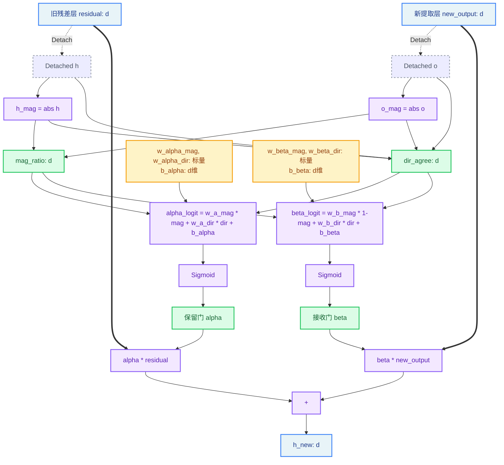

# ResidualGate V2：基于第一性原理的直接物理映射设计

## 一、核心问题

当前 ResidualGate 的设计路径是：

```
mag_ratio, dir_agree (物理信号)
    ↓
concat([h, o, mag, dir]) → gate_A (4d→16) → gate_B (16→d) → sigmoid → α, β
```

**第一性原理质疑**：既然 `mag_ratio` 和 `dir_agree` 已经是每个 hidden-size 维度的标量信号，它们本身就编码了"该维度应该保留多少旧信息、接受多少新信息"的物理含义。为什么还需要一个参数化的低秩网络来"学习"如何从这些信号计算 α 和 β？

## 二、物理信号的含义分析

### mag_ratio ∈ [0, 1]（每维度）
```
mag_ratio_j = |h_j| / (|h_j| + |o_j| + ε)
```
- `mag_ratio → 1`：h 在该维度已经很强，o 很弱 → h 主导
- `mag_ratio → 0`：o 在该维度很强，h 很弱 → o 主导
- `mag_ratio ≈ 0.5`：两者势均力敌

### dir_agree ∈ [-1, 1]（每维度）
```
dir_agree_j = (h_j · o_j) / (|h_j| · |o_j| + ε)
```
- `dir_agree → +1`：h 和 o 在该维度同号（协同）→ 两者都可以保留
- `dir_agree → -1`：h 和 o 在该维度反号（冲突）→ 需要做选择
- `dir_agree ≈ 0`：一方接近零，无明确方向关系

## 三、V2 设计：直接物理映射

### 核心思想

用 **少量可学习标量参数** 将 mag_ratio 和 dir_agree 直接映射为 α 和 β，无需低秩网络。

### 公式推导

α（保留门）应该在以下情况下高：
- h 在该维度已经很强（mag_ratio 高）
- h 和 o 方向一致（dir_agree 高，不需要遗忘旧信息）

β（接受门）应该在以下情况下高：
- o 在该维度很强（1 - mag_ratio 高）
- h 和 o 方向一致（dir_agree 高，新信息是有益的补充）

**V2 公式**：

```python
# 可学习参数（每个 ResidualGate 只有 4 个标量 + 2 个 per-dim 偏置）
# w_α_mag, w_α_dir: 标量权重，控制 mag/dir 对 α 的影响强度
# w_β_mag, w_β_dir: 标量权重，控制 mag/dir 对 β 的影响强度
# b_α, b_β: per-dim 偏置 (d,)，初始化为 init_bias

α_logit = w_α_mag * mag_ratio + w_α_dir * dir_agree + b_α    # (B, T, d)
β_logit = w_β_mag * (1 - mag_ratio) + w_β_dir * dir_agree + b_β  # (B, T, d)

α = sigmoid(α_logit)  # (B, T, d)
β = sigmoid(β_logit)  # (B, T, d)

h_new = α ⊙ h + β ⊙ o
```

### 参数量对比

| 设计 | 参数量 | 说明 |
|------|--------|------|
| V1 (当前) | gate_A: 4d×16 + gate_B_alpha: 16×d+d + gate_B_beta: 16×d+d = 4d×16 + 32d + 2d = 96d + 2d ≈ 98d | d=1024 → 100K per gate |
| V2 (直接映射) | 4 标量 + 2×d 偏置 = 4 + 2d | d=1024 → 2K per gate |

**参数减少 ~50 倍**，但每个维度仍然有独立的门控能力（通过 per-dim bias）。

## 四、梯度传播分析

### V2 的梯度路径

```
∂L/∂h 通过 h_new = α⊙h + β⊙o:
  ∂h_new/∂h = α                    (直接路径，α≈1 时梯度畅通)
  
∂L/∂o 通过 h_new:
  ∂h_new/∂o = β                    (直接路径，β≈1 时梯度畅通)

∂L/∂w_α_mag 通过 α:
  ∂h_new/∂w_α_mag = σ'(α_logit) · mag_ratio · h    (mag_ratio 是 detached 的)
  
∂L/∂b_α:
  ∂h_new/∂b_α = σ'(α_logit) · h
```

**关键优势**：
1. **梯度直通**：α 和 β 直接乘以 h 和 o，没有中间的低秩瓶颈
2. **无梯度消失风险**：不经过 gate_A→gate_B 的两层线性变换
3. **物理可解释**：w_α_mag 学到的值直接告诉我们"幅度比对保留决策的影响权重"

### 潜在问题：mag_ratio 和 dir_agree 是 detached 的

这意味着 **α 和 β 对 h 和 o 没有梯度路径**（通过 gate 参数）。

在 V1 中，gate_input 包含了带梯度的 h 和 o，所以 gate 的输出对 h/o 有梯度。但在 V2 中，α 和 β 只依赖于 detached 的 mag/dir 信号。

**这是否是问题？**

不是。因为：
- `h_new = α⊙h + β⊙o` 中，h 和 o 本身就直接参与了乘法，梯度通过 `α⊙h` 和 `β⊙o` 直接回传
- gate 参数（w, b）的梯度来自 `∂L/∂α · ∂α/∂w`，其中 `∂L/∂α = h · ∂L/∂h_new`，这已经包含了 h 的信息
- 实际上，V1 中 h/o 在 gate_input 中带梯度反而可能导致 **梯度干扰**：gate 的梯度会反向影响 h/o 的更新，这不一定是好事

## 五、进一步思考：是否需要 per-dim bias？

### 方案 A：纯标量参数（最简）
```python
α = sigmoid(w_α_mag * mag_ratio + w_α_dir * dir_agree + b_α)  # b_α 是标量
β = sigmoid(w_β_mag * (1-mag_ratio) + w_β_dir * dir_agree + b_β)  # b_β 是标量
```
参数量：6 个标量 per gate。所有维度共享相同的映射函数。

**问题**：不同维度可能需要不同的保留/接受策略。例如，某些维度可能天然需要更高的保留率。

### 方案 B：per-dim bias（推荐）
```python
α = sigmoid(w_α_mag * mag_ratio + w_α_dir * dir_agree + b_α)  # b_α 是 (d,) 向量
β = sigmoid(w_β_mag * (1-mag_ratio) + w_β_dir * dir_agree + b_β)  # b_β 是 (d,) 向量
```
参数量：4 标量 + 2d per gate。每个维度有独立的基准偏置。

**优势**：per-dim bias 允许模型学习"第 j 维天然倾向于保留/遗忘"，而 mag/dir 信号提供动态调节。

### 方案 C：per-dim 全参数（最灵活）
```python
α = sigmoid(w_α_mag * mag_ratio + w_α_dir * dir_agree + b_α)
# 其中 w_α_mag, w_α_dir, b_α 都是 (d,) 向量
```
参数量：6d per gate。每个维度有完全独立的映射参数。

**问题**：参数量增加但仍远小于 V1，可能过拟合风险略高。

## 六、推荐方案：方案 B（per-dim bias）

```python
class ResidualGate(nn.Module):
    def __init__(self, hidden_size, init_bias=5.0):
        super().__init__()
        self.hidden_size = hidden_size
        
        # 4 个标量权重：控制 mag/dir 对 α/β 的影响强度
        self.w_alpha_mag = nn.Parameter(torch.zeros(1))   # 初始 0 → 初始时 mag 不影响 α
        self.w_alpha_dir = nn.Parameter(torch.zeros(1))   # 初始 0 → 初始时 dir 不影响 α
        self.w_beta_mag = nn.Parameter(torch.zeros(1))    # 初始 0
        self.w_beta_dir = nn.Parameter(torch.zeros(1))    # 初始 0
        
        # per-dim 偏置：初始化为 init_bias → sigmoid(5)≈0.993
        self.b_alpha = nn.Parameter(torch.full((hidden_size,), init_bias))
        self.b_beta = nn.Parameter(torch.full((hidden_size,), init_bias))
    
    def forward(self, residual, new_output):
        eps = 1e-5
        h_mag = residual.detach().abs()
        o_mag = new_output.detach().abs()
        
        mag_ratio = h_mag / (h_mag + o_mag + eps)
        dir_agree = (residual.detach() * new_output.detach()) / (h_mag * o_mag + eps)
        
        alpha = torch.sigmoid(
            self.w_alpha_mag * mag_ratio + self.w_alpha_dir * dir_agree + self.b_alpha
        )
        beta = torch.sigmoid(
            self.w_beta_mag * (1.0 - mag_ratio) + self.w_beta_dir * dir_agree + self.b_beta
        )
        
        return alpha * residual + beta * new_output
```

### 初始化分析

初始时 w=0, b=5.0：
- `α = sigmoid(0 + 0 + 5.0) = 0.993`
- `β = sigmoid(0 + 0 + 5.0) = 0.993`
- `h_new ≈ 0.993h + 0.993o ≈ h + o` ✅ 近恒等

训练后，w 逐渐偏离 0：
- 如果 `w_alpha_mag > 0`：mag_ratio 高的维度（h 强）→ α 更高（保留更多）
- 如果 `w_beta_mag > 0`：(1-mag_ratio) 高的维度（o 强）→ β 更高（接受更多）
- 如果 `w_alpha_dir > 0`：方向一致的维度 → α 更高（协同时保留）
- per-dim bias 逐渐分化 → 不同维度有不同的基准策略

## 七、数据流图（V2）



## 八、与 V1 的对比

| 维度 | V1 低秩网络 | V2 直接映射 |
|------|------------|------------|
| 参数量 | ~100K per gate | ~2K per gate |
| 计算量 | 2次矩阵乘法 | 4次逐元素乘法 |
| 梯度路径 | h,o → gate_A → gate_B → sigmoid | 纯 detached 信号 → sigmoid |
| 可解释性 | 黑盒低秩网络 | 4个标量权重直接可解释 |
| 表达能力 | 可学习任意 h,o → alpha,beta 映射 | 限制为 mag/dir 的线性组合 |
| 初始化稳定性 | 需要精心平衡 gate_A/B 的 std | 简单：w=0, b=init_bias |
| 梯度消失风险 | gate_A→gate_B 两层可能梯度衰减 | 无中间层，无风险 |

## 九、实施计划

1. 在 `modeling_mag_gated.py` 中实现 V2 版 ResidualGate
2. 保持 V1 作为可选项（通过 config 参数切换）
3. 更新 config 添加 `residual_gate_version` 参数
4. 更新 gate_monitor_callback 适配 V2
5. 更新 create_mag_gated_model.py 支持 V2
6. 运行测试验证
